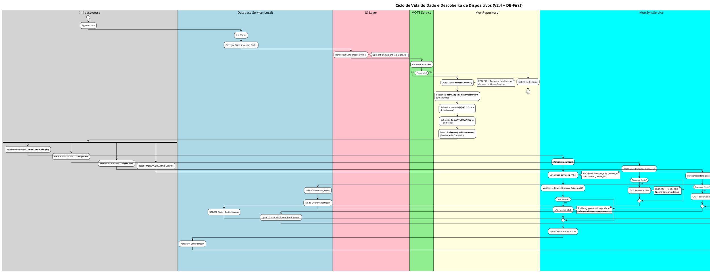
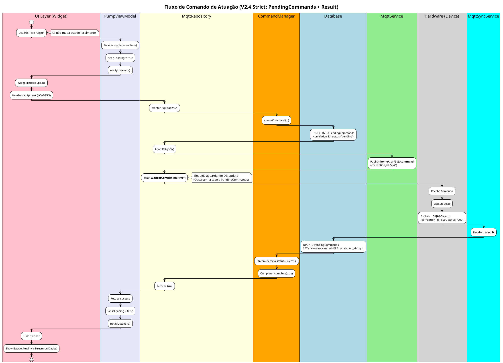

# Fluxo de Dados e Ciclo de Vida - App Flutter (Diagnóstico)

## Diagrama de Fluxo de Dados (Data Flow Diagram)

Este diagrama detalha o caminho do dado desde a recepção via MQTT/Banco de Dados até a renderização na UI, expondo pontos críticos de sincronização.

## Fluxo de Comando (UX Pessimista + Timeout + Error Handling)

Este fluxo mostra a aderência total à regra de "Verdade Assíncrona", "UI Pessimista" e tratamento de erros via `.../result`.

