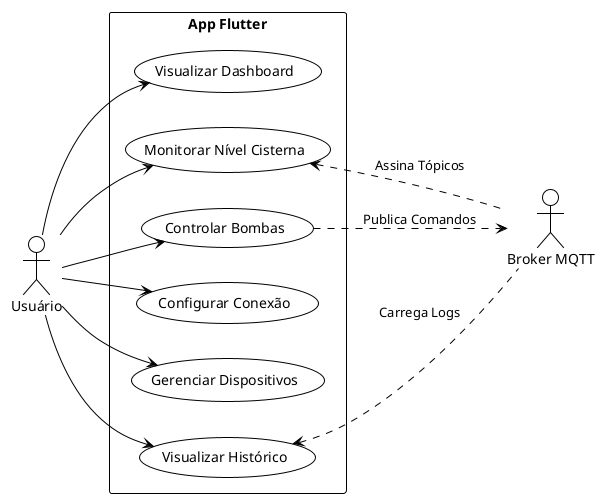
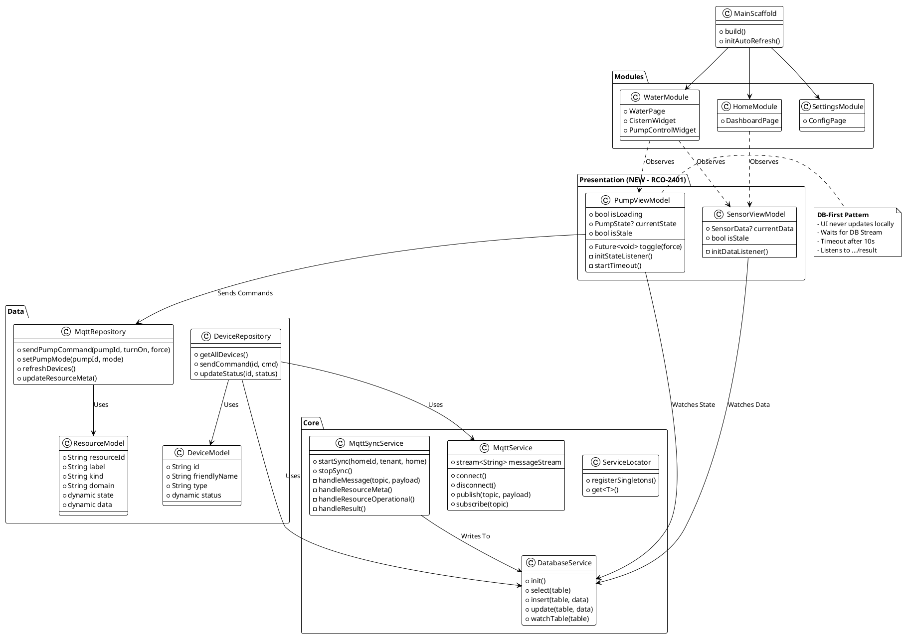
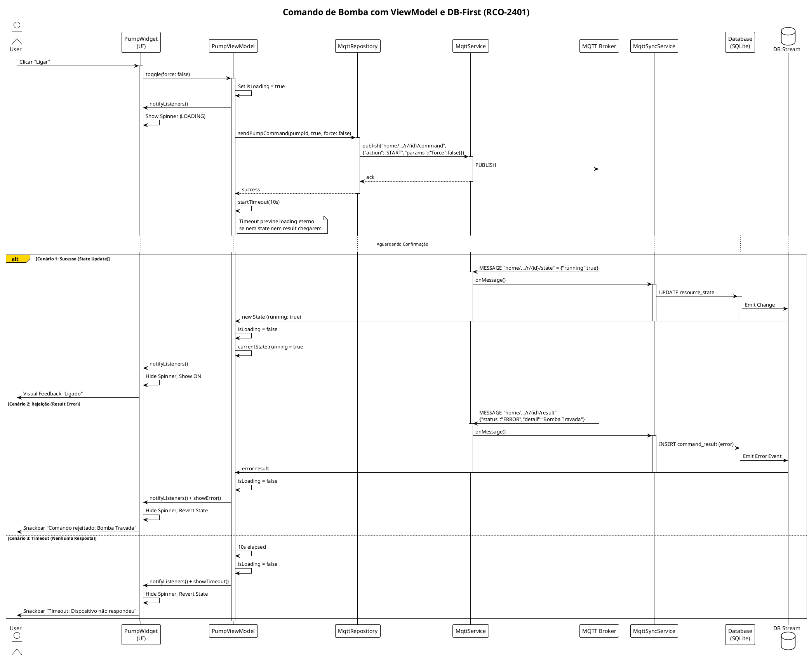

# UML App Flutter - PlantUML

## Diagrama de Casos de Uso (Use Case Diagram)

## Diagrama de Classes (Class Diagram)

## Diagrama de Sequência (Sequence Diagram) - Comando de Bomba (V2.4 + DB-First)

