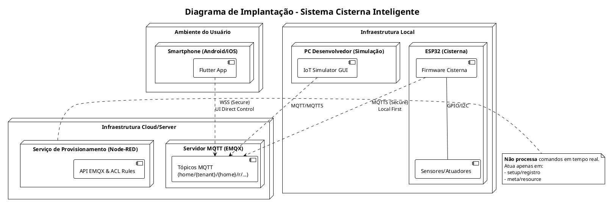
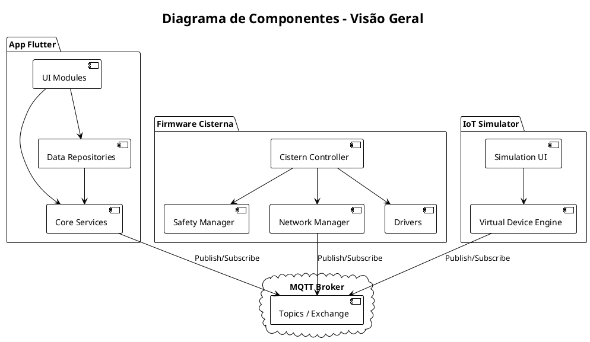

# Arquitetura Geral do Sistema - PlantUML

## Diagrama de Implantação (Deployment Diagram)

```plantuml
@startuml
!theme plain
title Diagrama de Implantação - Sistema Cisterna Inteligente

node "Ambiente do Usuário" {
    node "Smartphone (Android/iOS)" as Mobile {
        component "Flutter App" as App
    }
}

node "Infraestrutura Local" {
    node "ESP32 (Cisterna)" as ESP32 {
        component "Firmware Cisterna" as FW
        component "Sensores/Atuadores" as HW
    }
    
    node "PC Desenvolvedor (Simulação)" as PC {
        component "IoT Simulator GUI" as Sim
    }
}

node "Infraestrutura Cloud/Server" {
    node "Servidor MQTT (EMQX)" as Broker {
        component "Tópicos MQTT\n(home/{tenant}/{home}/r/...)" as Topics
    }
    
    node "Serviço de Provisionamento (Node-RED)" as NodeRED {
        component "API EMQX & ACL Rules" as Rules
    }
}

App ..> Topics : WSS (Secure)\nUI Direct Control
FW ..> Topics : MQTTS (Secure)\nLocal First
Sim ..> Topics : MQTT/MQTTS

FW -- HW : GPIO/I2C

note right of NodeRED
  **Não processa** comandos em tempo real.
  Atua apenas em:
  - setup/registro
  - meta/resource
end note
@enduml
```

## Diagrama de Componentes (Component Diagram)

```plantuml
@startuml
!theme plain
title Diagrama de Componentes - Visão Geral

package "App Flutter" {
    [UI Modules] as UI
    [Core Services] as Core
    [Data Repositories] as Repo
    
    UI --> Core
    UI --> Repo
    Repo --> Core
}

package "Firmware Cisterna" {
    [Cistern Controller] as Ctrl
    [Safety Manager] as Safety
    [Network Manager] as Net
    [Drivers] as Drivers
    
    Ctrl --> Safety
    Ctrl --> Net
    Ctrl --> Drivers
}

package "IoT Simulator" {
    [Virtual Device Engine] as VDE
    [Simulation UI] as SimUI
    
    SimUI --> VDE
}

cloud "MQTT Broker" {
    [Topics / Exchange] as MQTT
}

Core --> MQTT : Publish/Subscribe
Net --> MQTT : Publish/Subscribe
VDE --> MQTT : Publish/Subscribe

@enduml
```
