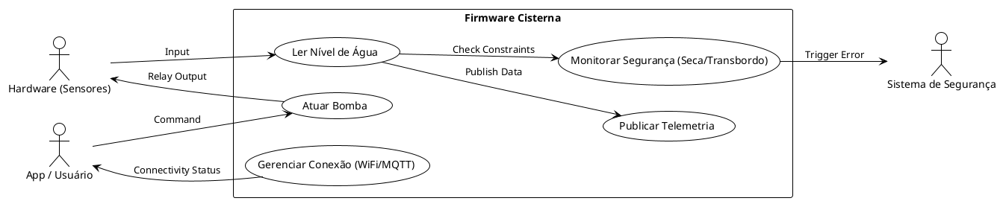
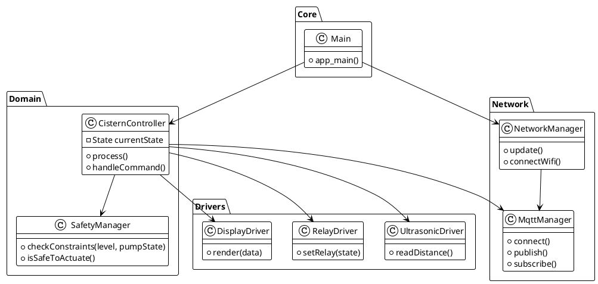
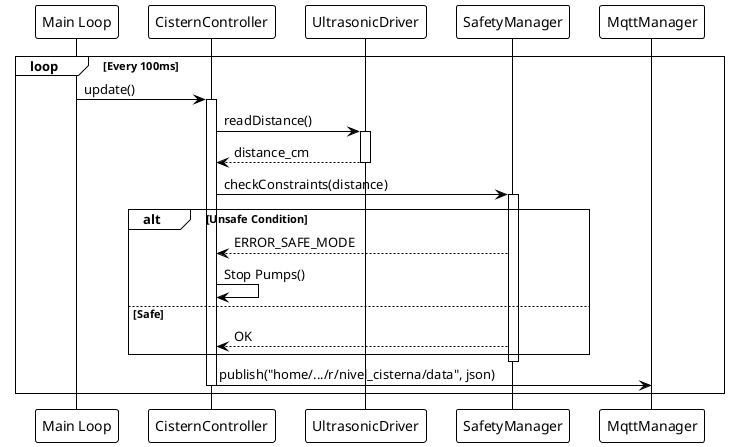

# UML Firmware Cisterna - PlantUML

## Diagrama de Casos de Uso

```plantuml
@startuml
!theme plain
left to right direction
actor "Hardware (Sensores)" as HW
actor "App / Usuário" as App
actor "Sistema de Segurança" as Safety

rectangle "Firmware Cisterna" {
    usecase "Ler Nível de Água" as UC1
    usecase "Atuar Bomba" as UC2
    usecase "Publicar Telemetria" as UC3
    usecase "Monitorar Segurança (Seca/Transbordo)" as UC4
    usecase "Gerenciar Conexão (WiFi/MQTT)" as UC5
}

HW --> UC1 : Input
UC1 --> UC4 : Check Constraints
UC4 --> Safety : Trigger Error
App --> UC2 : Command
UC2 --> HW : Relay Output
UC1 --> UC3 : Publish Data
UC5 --> App : Connectivity Status
@enduml
```

## Diagrama de Classes

```plantuml
@startuml
!theme plain

package "Core" {
    class Main {
        + app_main()
    }
}

package "Domain" {
    class CisternController {
        - State currentState
        + process()
        + handleCommand()
    }
    
    class SafetyManager {
        + checkConstraints(level, pumpState)
        + isSafeToActuate()
    }
}

package "Network" {
    class NetworkManager {
        + update()
        + connectWifi()
    }
    
    class MqttManager {
        + connect()
        + publish()
        + subscribe()
    }
}

package "Drivers" {
    class UltrasonicDriver {
        + readDistance()
    }
    
    class RelayDriver {
        + setRelay(state)
    }
    
    class DisplayDriver {
        + render(data)
    }
}

Main --> CisternController
Main --> NetworkManager

CisternController --> SafetyManager
CisternController --> UltrasonicDriver
CisternController --> RelayDriver
CisternController --> DisplayDriver
CisternController --> MqttManager

NetworkManager --> MqttManager
@enduml
```

## Diagrama de Sequência (Loop Principal)

```plantuml
@startuml
!theme plain
participant "Main Loop" as Main
participant "CisternController" as Ctrl
participant "UltrasonicDriver" as Sensor
participant "SafetyManager" as Safety
participant "MqttManager" as MQTT

loop Every 100ms
    Main -> Ctrl : update()
    activate Ctrl
    
    Ctrl -> Sensor : readDistance()
    activate Sensor
    Sensor --> Ctrl : distance_cm
    deactivate Sensor
    
    Ctrl -> Safety : checkConstraints(distance)
    activate Safety
    
    alt Unsafe Condition
        Safety --> Ctrl : ERROR_SAFE_MODE
        Ctrl -> Ctrl : Stop Pumps()
    else Safe
        Safety --> Ctrl : OK
    end
    deactivate Safety
    
    Ctrl -> MQTT : publish("home/.../r/nivel_cisterna/data", json)
    deactivate Ctrl
end
@enduml
```
