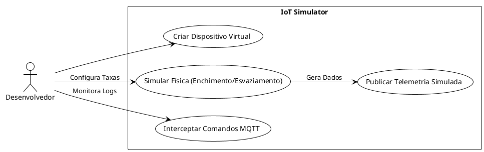
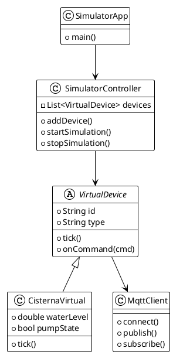
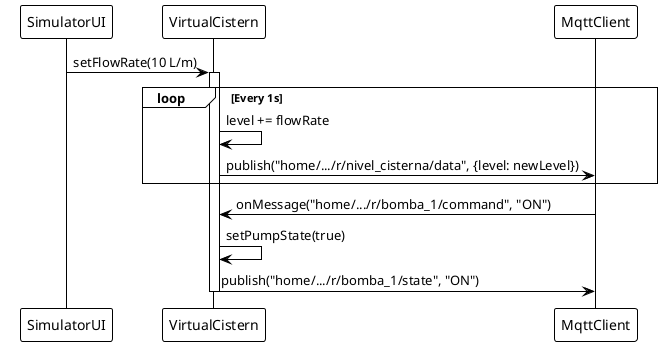

# UML IoT Simulator - PlantUML

## Diagrama de Casos de Uso

```plantuml
@startuml
!theme plain
left to right direction
actor "Desenvolvedor" as Dev

rectangle "IoT Simulator" {
    usecase "Criar Dispositivo Virtual" as UC1
    usecase "Simular Física (Enchimento/Esvaziamento)" as UC2
    usecase "Interceptar Comandos MQTT" as UC3
    usecase "Publicar Telemetria Simulada" as UC4
}

Dev --> UC1
Dev --> UC2 : Configura Taxas
Dev --> UC3 : Monitora Logs
UC2 --> UC4 : Gera Dados
@enduml
```

## Diagrama de Classes

```plantuml
@startuml
!theme plain

class SimulatorApp {
    + main()
}

class SimulatorController {
    - List<VirtualDevice> devices
    + addDevice()
    + startSimulation()
    + stopSimulation()
}

abstract class VirtualDevice {
    + String id
    + String type
    + tick()
    + onCommand(cmd)
}

class CisternaVirtual extends VirtualDevice {
    + double waterLevel
    + bool pumpState
    + tick()
}

class MqttClient {
    + connect()
    + publish()
    + subscribe()
}

SimulatorApp --> SimulatorController
SimulatorController --> VirtualDevice
VirtualDevice --> MqttClient
@enduml
```

## Diagrama de Sequência (Simulação)

```plantuml
@startuml
!theme plain
participant "SimulatorUI" as UI
participant "VirtualCistern" as Sim
participant "MqttClient" as MQTT

UI -> Sim : setFlowRate(10 L/m)
activate Sim

loop Every 1s
    Sim -> Sim : level += flowRate
    Sim -> MQTT : publish("home/.../r/nivel_cisterna/data", {level: newLevel})
end

MQTT -> Sim : onMessage("home/.../r/bomba_1/command", "ON")
Sim -> Sim : setPumpState(true)
Sim -> MQTT : publish("home/.../r/bomba_1/state", "ON")
deactivate Sim
@enduml
```
